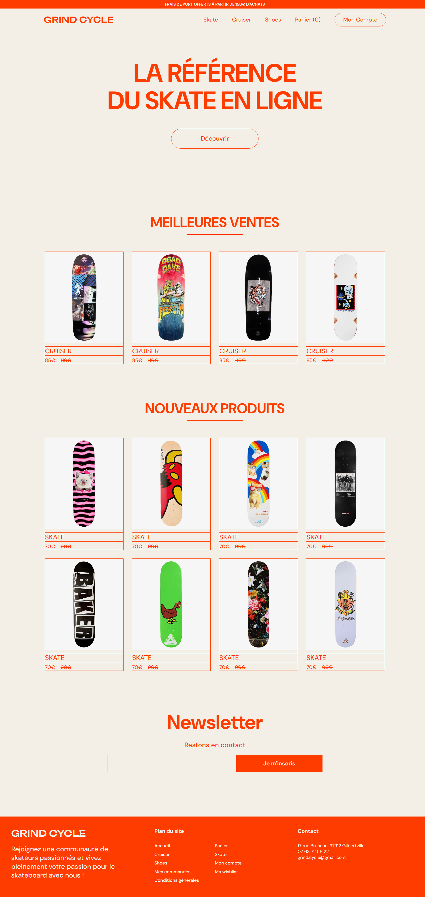

[Live](https://kabukikitchen.netlify.app/)

Voilà mon deuxième projet personnel en React : la création d'un site de livraison pour un restaurant japonais. 

Via React., j'ai conçu une interface utilisateur fluide et intuitive, permettant aux utilisateurs de parcourir le menu avec facilité, remplir leur panier et faire le processus de livraison. 

Ce projet m'a permis de combiner programmation avec mon intérêt pour la gastronomie japonaise !
